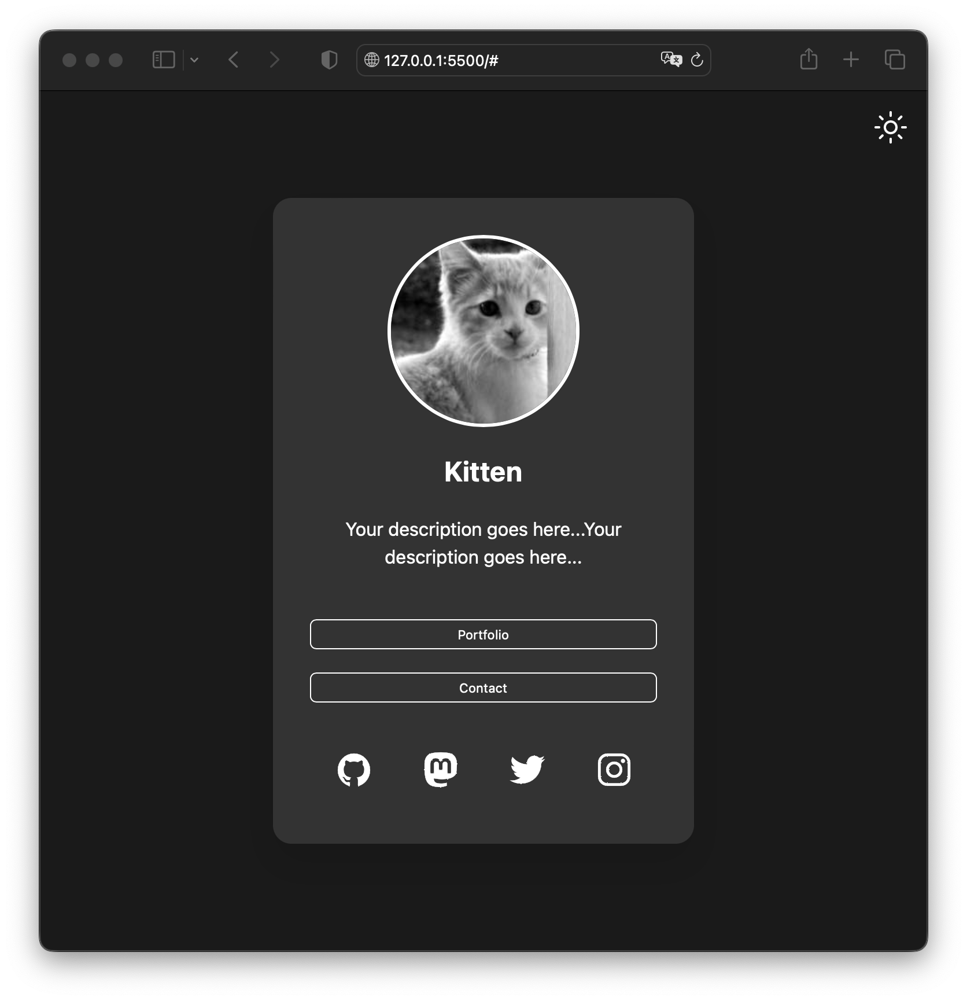

# Profile Card

A responsive profile card with a theme toggle feature that allows users to switch between light and dark themes. The profile card contains a profile picture, headline, description, personal links, and social links.



## Usage as a GitHub Page

1. Fork this repository to your GitHub account.
2. Go to the repository settings.
3. Under the "GitHub Pages" section, select the "main" branch as the source and click "Save".
4. Your profile card will be published at `https://<your-username>.github.io/<repository-name>/`.

## Customization

1. Open the `config.js` file in the project.
2. Modify the `profileCardConfig` object to customize your profile card with your own data, links, and themes.

```javascript
const profileCardConfig = {
  profile: {
    picture: "http://placekitten.com/g/200/300",
    headline: "Kitten",
    description: "Your description goes here...Your description goes here...",
  },
  personalLinks: [
    { text: "Portfolio", url: "#" },
    { text: "Contact", url: "#" },
  ],
  socialLinks: [
    { icon: "logo-github", url: "#" },
    { icon: "logo-mastodon", url: "#" },
    { icon: "logo-twitter", url: "#" },
    { icon: "logo-instagram", url: "#" },
  ],
  themes: {
    light: {
      "--bg-color": "#fff",
      "--text-color": "#000",
      "--card-bg-color": "#e4e4e4",
      "--accent-color": "#007BFF",
    },
    dark: {
      "--bg-color": "#1a1a1a",
      "--text-color": "#fff",
      "--card-bg-color": "#333",
      "--accent-color": "#00BCD4",
    },
  },
};
```

3. Commit and push your changes to the repository.
4. Your profile card will be updated with your customizations.

## License

This project is open-source and available under the MIT License. See [LICENSE](LICENSE) for more information.
